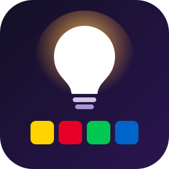
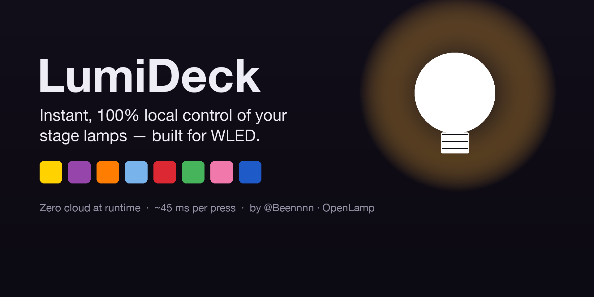
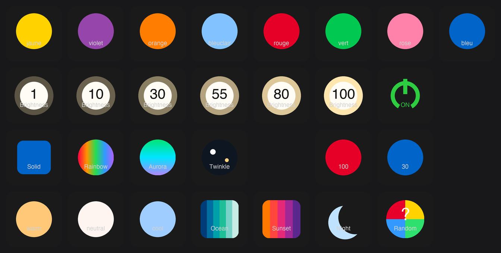
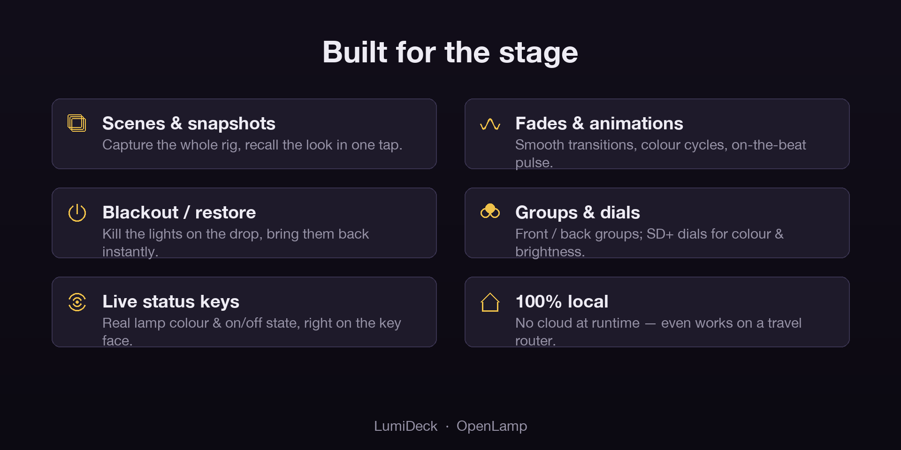

# LumiDeck

**Control your WLED lamps & strips from an [Elgato Stream Deck](https://www.elgato.com/stream-deck) — 100% local, cloud-free, instant (~45 ms per press).**

> **A controller *for* [WLED](https://kno.wled.ge) — not affiliated with or endorsed by the WLED project or Elgato.**
> LumiDeck talks to your WLED devices over their **public local HTTP API**, nothing else. No cloud account, no internet dependency, no lag: one key press = one immediate change. Built by a keyboard player to run stage lamps at gigs — no surprises.

---

## What it is

LumiDeck turns a Stream Deck into a **stage-lighting controller** for WLED lamps and strips.
Every key press is a WLED JSON patch sent straight to the device on your LAN — near-instant,
no middle-man. Keys render their state in real time (generated on the fly, not static icons),
and dials on a Stream Deck + sweep colour, brightness, white balance, effects and palettes.

*A LumiDeck profile on a Stream Deck XL — colours, brightness, effects, white/CCT, palettes by name, nightlight, live ON/OFF. Every key visual is generated in real time by the plugin.*

## Built for the stage

- 🎨 **Colours** — 8 high-contrast stage colours (Kelly palette), custom colour + brightness.
- 💡 **Brightness** — master and per-segment, 6 presets or a precise value, shown as a luminous % core.
- ⚪ **White & CCT** — dedicated white channel + tunable warm↔cool on RGBCW devices.
- ✨ **Effects & palettes** — WLED's full effect list and 70+ palettes, pickable **by name**, with speed/intensity.
- 🎬 **Scenes / snapshots / fades / blackout** — capture a full multi-lamp look and recall it in one key; blackout & restore; a per-button **Fade (ms)** so each key gets its own transition.
- 🌙 **Nightlight** — timed fade-off with a live **mm:ss countdown** on the key.
- ⏱️ **Presets & playlists** — save the current state, recall by name, native on-device preset-cycle.
- 🔀 **Groups & targeting** — drive one lamp, a named group, or all of them.
- 🖥️ **Live-state keys** — ON/OFF and current colour reflected on the key face in real time.
- 🔎 **Auto-discovery** — WLED lamps on your network are found automatically. **No IPs to type.**
- 🎚️ **Stream Deck +** — rotary dials for colour, brightness, white balance, effect and palette.
- 📇 **Ready-made profiles** — bundled Stream Deck **XL** (4 pages, easy → advanced) and Stream Deck **+** profiles.
- 🌐 **8 languages** with a language selector.
- 🎹 **MIDI & beat sync** — drive the lamps from a MIDI controller/DAW and flash them **on the beat** (MIDI clock or **Ableton Link**), with latency anticipation and a downbeat accent.

## How it works

Every action is a **WLED JSON patch** (`POST /json/state`) sent straight to the device's local
API — near-instant, no cloud. A small bundled engine adds the conveniences the firmware
doesn't (named groups, full-look snapshots, fades, blackout, animations). 100% local: nothing
leaves your network — it even works on a stage/travel router with no internet.

## Get LumiDeck

- **Elgato Marketplace** — *coming soon.*
- Self-contained macOS build (Apple Silicon + Intel). **Nothing to install** — no Python, no dependencies, no terminal.

## Recommended hardware

Any WLED lamp/strip/controller on your network works. Reference bulb:
**[Athom 12 W RGBCW E27, pre-flashed with WLED](https://kno.wled.ge)** (ESP32-C3, ~€13) —
RGB + a dedicated white channel + tunable warm↔cool. Measured at **~45 ms end-to-end, every time**.

## Support — report a bug or request a feature

This repository is LumiDeck's **public tracker** (the product itself is a proprietary app; there's
no source here). Open an [issue](https://github.com/openlamp/streamdeck-plugin-lumideck-support/issues/new/choose)
and pick **Bug report** or **Feature request**. For bugs, please include your OS, Stream Deck
model, WLED firmware version, lamp model, and steps to reproduce.

## Credits & legal

Built by **[@Beennnn](https://github.com/Beennnn)**. LumiDeck is a commercial product —
**proprietary, all rights reserved.**

Not affiliated with, nor endorsed by, the **WLED** project or **Elgato**. WLED is an independent
open-source project ([wled/WLED](https://github.com/wled/WLED), originally by Aircoookie, now
maintained by the WLED community); LumiDeck merely **interoperates** with WLED devices over their
public local HTTP API, and uses the name "WLED" only to describe that compatibility. "Stream Deck"
and "Elgato" are trademarks of Corsair.
